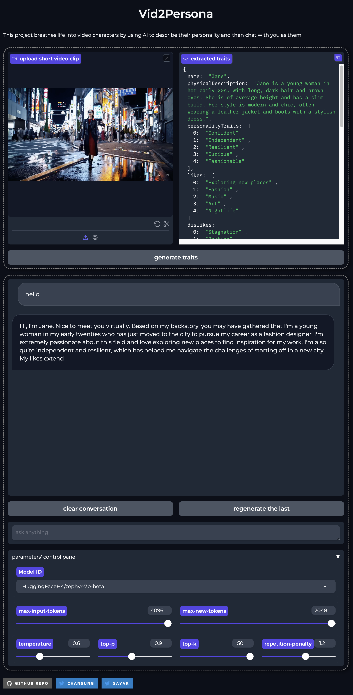

# Vid2Persona

This project breathes life into video characters by using AI to describe their personality and then chat with you as them.

<div align="center">

</div>

## Brainstormed workflow

1. get a person's description from the video clip using Large Multimodal Model
    - We choose [Get video descriptions](https://cloud.google.com/vertex-ai/generative-ai/docs/video/video-descriptions#vid-desc-rest) service from [Generative AI on Vertex AI](https://cloud.google.com/vertex-ai/generative-ai).
      
2. based on the description, ask Large Language Model to pretend to be the person
3. then, chatting with that personality
    - We choose either [Gemini API from Google AI Studio](https://ai.google.dev/) or [Gemini API from Generative AI on Vertex AI](https://cloud.google.com/vertex-ai/generative-ai/docs/model-reference/gemini).

The final output is the Gradio based chatting application hosted on [Hugging Face Space](https://huggingface.co/spaces).

Optionally, we could leverage other open source technologies
- [diffusers](https://huggingface.co/docs/diffusers/en/index) to generate images of the person in different poses or the backgrounds
- [transformers](https://huggingface.co/docs/transformers/en/index) to replace closed Gemini model with open models such as [LLaMA2](https://llama.meta.com/), [Gemma](https://blog.google/technology/developers/gemma-open-models/), [Mistral](https://mistral.ai/), etc.

## Realized workflow

### Character description

We obtain a description from an input video using the [Gemini Pro 1.0 API](https://ai.google.dev/). We create a custom prompt (which we brainstormed with help of ChatGPT) to provide as inputs to the API along with the video. The prompt is available in [this file](./vid2persona/prompts/vlm.toml). 

Refer to [this notebook](./notebooks/Ask_about_character.ipynb) for a rundown. 

Here is an example of how a Gemini response looks like:

```json
{
 "characters": [
   {
     "name": "Alice",
     "physicalDescription": "Alice is a young woman with long, wavy brown hair and hazel eyes. She is of average height and has a slim build. Her most distinctive feature is her warm, friendly smile.",
     "personalityTraits": [
       "Alice is a kind, compassionate, and intelligent woman. She is always willing to help others and is a great listener. She is also very creative and has a great sense of humor.",
     ],
     "likes": [
       "Alice loves spending time with her friends and family.",
       "She enjoys reading, writing, and listening to music.",
       "She is also a big fan of traveling and exploring new places."
     ],
     "dislikes": [
       "Alice dislikes rudeness and cruelty.",
       "She also dislikes being lied to or taken advantage of.",
       "She is not a fan of heights or roller coasters."
     ],
     "background": [
       "Alice grew up in a small town in the Midwest.",
       "She was always a good student and excelled in her studies.",
       "After graduating from high school, she moved to the city to attend college.",
       "She is currently working as a social worker."
     ],
     "goals": [
       "Alice wants to make a difference in the world.",
       "She hopes to one day open her own counseling practice.",
       "She also wants to travel the world and experience different cultures."
     ],
     "relationships": [
       "Alice is very close to her family and friends.",
       "She is also in a loving relationship with her partner, Ben.",
       "She has a good relationship with her colleagues and is well-respected by her clients."
     ]
   }
 ]
}
```

### Chatting with the character

Next, we construct a system prompt from the response above and use it as an input to a Large Language Model (LLM). This prompt is available [here](./vid2persona/prompts/llm.toml). The system prompt helps the LLM to be character-aware. 

Refer to [this notebook](./notebooks/llm_personality.ipynb) for a rundown.

> [!NOTE]  
> If a video contains multiple characters, we construct the system prompt only for one.

You can find all of this collated into a single pipeline in [this demo](https://huggingface.co/spaces/chansung/vid2persona). Feel free to give it a try! 

## Design considerations

We designed the overall pipeline like so for the following reasons:

* Videos can be hard to process efficiently and captioning them requires quite a lot compute cavalry. The existing open solutions didn't meet our needs. This why we delegated this part of the pipeline to Gemini. 
* On the other hand, the literature around making LLMs accessible is widely popular, thanks to tools like `bitsandbytes`. For the second part of the pipeline, we wanted to provide the users the flexibility of "bring your own language model". This is also because there's an abundance of high-quality open LLMs particularly good at this task. For our project, we used [HuggingFaceH4/zephyr-7b-beta](https://huggingface.co/HuggingFaceH4/zephyr-7b-beta) because it's small (7B) and also very performant. 

For the scaling the second part of the pipeline, [`text-generation-inference`](https://huggingface.co/docs/text-generation-inference) is leveraged. 

## Acknowledgments

This is a project built during the Gemini sprint held by Google's ML Developer Programs team. We are thankful to be granted good amount of GCP credits to finish up this project.

